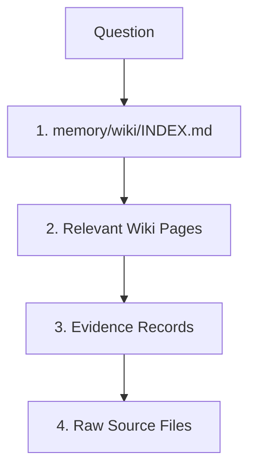
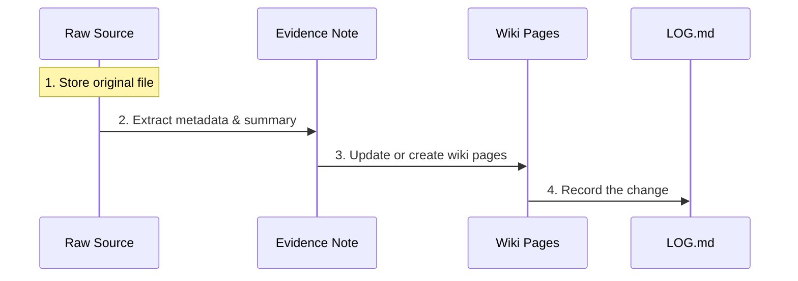

# Memoid

> [!CAUTION]
> **Experimental Project**: Memoid is currently in an early, experimental stage and is not intended for production environments. It is, however, an ideal sandbox for exploring and experimenting with autonomous, markdown-first memory systems.

Memoid is a markdown-first memory system for AI agents that merges [Karpathy's LLM Wiki approach](https://gist.github.com/karpathy/442a6bf555914893e9891c11519de94f) and [MemPalace](https://github.com/MemPalace/mempalace).

It is designed to be your **"Global Second Brain"** — accessible by any AI agent (Claude, Gemini, Codex, Cursor, GitHub Copilot, OpenCode) regardless of which project you are currently working on.

Works in two modes:
- **Standalone** — a dedicated repo that acts as a persistent second brain across projects
- **Embedded** — a `memory/` folder dropped into an existing project repo

---

## 🧠 Philosophy & Rationale

Memoid was built to solve the "Agentic Amnesia" problem. While most RAG (Retrieval-Augmented Generation) systems treat memory as a hidden vector database, Memoid treats memory as a **transparent, human-readable wiki**.

### The Hybrid Advantage

By combining **Karpathy's LLM Wiki** and **MemPalace**, Memoid offers:

- **Compounding Synthesis**: Knowledge isn't just "found"; it is compiled. The more you work, the more the Wiki improves.
- **Operational Discipline**: Explicit protocols prevent the "pile of summaries" problem found in unmanaged wikis.
- **Evidence-Backed**: Every wiki claim is linked to an immutable raw source or a session record, ensuring you can always audit *why* the AI remembers something.
- **Zero Lock-in**: Your memory is just Markdown and Git. You can browse it in Obsidian, edit it in VS Code, or version control it like code.
- **Bounded Performance**: Retrieval returns relevant excerpts, not full file dumps — fast even as your wiki grows.

### Feature Comparison

| Feature                          | Karpathy Wiki | MemPalace | Memoid (Hybrid) |
|:-------------------------------- |:-------------:|:---------:|:---------------:|
| **Markdown-First**               | ✅             | ❌         | ✅               |
| **Git-Native**                   | ✅             | ❌         | ✅               |
| **Immutable Raw Sources**        | ✅             | ✅         | ✅               |
| **Maintained Wiki Synthesis**    | ✅             | ❌         | ✅               |
| **Evidence & Session Records**   | ❌             | ✅         | ✅               |
| **Specialist Agent Continuity**  | ❌             | ✅         | ✅               |
| **Bounded Wake-Up Context**      | ❌             | ✅         | ✅               |
| **Structured Lint Checks**       | ⚠️            | ❌         | ✅               |
| **Explicit Operating Protocols** | ⚠️            | ✅         | ✅               |
| **MCP / Global Tool Access**     | ❌             | ❌         | ✅               |
| **Bounded Excerpt Retrieval**    | ❌             | ❌         | ✅               |
| **Low Tooling Complexity**       | ✅             | ❌         | ✅               |

### ⚠️ Limitations

- **Not a Vector DB**: It relies on text search and agent-led navigation. It is optimized for quality and context, not for millisecond-latency searches over millions of documents.
- **Agent Effort**: It requires the AI to perform "work" (following protocols) to maintain the memory. It is a system for high-quality synthesis, not low-effort data dumping.
- **Git Discipline**: To keep your memory synced across machines, you must manage your own Git pushes/pulls.

---

## 🏗️ Architecture

Memoid is 100% transparent. No databases, just interlinked Markdown files.

```
memoid/
├── AGENTS.md               # Master orchestrator instructions
├── CLAUDE.md / GEMINI.md / CURSOR.md / copilot-instructions.md  # Agent-specific guidance
├── SPEC.md                 # Architecture design rationale
├── memory/
│   ├── raw/                # Immutable source material (articles, transcripts, assets, inbox)
│   ├── wiki/
│   │   ├── IDENTITY.md     # What this system is, its values, agent behavior
│   │   ├── ESSENTIAL_STORY.md  # Current state, active threads, open questions
│   │   ├── INDEX.md        # Master index — links to every wiki page
│   │   ├── LOG.md          # Append-only activity log
│   │   ├── entities/       # People, projects, systems, tools
│   │   ├── concepts/       # Patterns, approaches, ideas
│   │   └── domains/        # Subject-area overviews
│   ├── evidence/
│   │   ├── sessions/       # Work records — one file per session
│   │   ├── decisions/      # Decision rationale — why, not just what
│   │   ├── source-notes/   # Source provenance and metadata
│   │   └── audits/         # Lint and consistency check reports
│   └── agents/             # Specialist agent diaries for meta-learning
├── protocols/              # The rules — Markdown programs the agent follows
│   ├── WAKE_UP.md          # Bounded context reconstruction at session start
│   ├── CONVENTIONS.md      # Page structure, naming, fact lifecycle (canonical reference)
│   ├── INGEST.md           # Raw source → evidence → wiki pipeline
│   ├── INGEST_CODE.md      # Codebase → evidence → wiki pipeline
│   ├── RETRIEVAL.md        # Answering questions from maintained knowledge
│   ├── SEARCH.md           # Structured search with explicit output format
│   ├── FILING.md           # Saving session work into durable memory
│   ├── COMPACTION.md       # Handoff before context loss
│   ├── LINT.md             # Structured consistency checks with pass/fail output
│   └── INIT.md             # First-use repository preparation
└── scripts/                # Lean CLI and MCP server
    ├── memoid              # CLI dispatcher
    ├── mcp_server.py       # MCP server for cross-project access
    └── post_init_check.py  # Runtime directory bootstrap
```

**Wiki** is the maintained synthesis — the agent creates and revises these freely, always keeping them current.

**Evidence** is the append-only record — session notes and decision rationale that back up wiki claims. Never edited after creation.

**Protocols** define exactly how to act in each situation. They are read before the agent acts and produce reproducible results.

---

## 🚀 Quick Start

### 1. Unified Installation (Recommended)

Run the one-line installer to clone Memoid, install the CLI, automatically initialize the `memory/` workspace, and optionally add the Memoid MCP entry to detected agent configs.

**Linux / macOS:**

```bash
curl -sSL https://raw.githubusercontent.com/latentarts/memoid/main/scripts/install.sh | bash
```

**Windows (PowerShell):**

```powershell
powershell -ExecutionPolicy Bypass -c "irm https://raw.githubusercontent.com/latentarts/memoid/main/scripts/install.ps1 | iex"
```

*The installer will ask for your preferred path, install `uv` if missing, run `memoid init` for you, detect supported AI agents, and offer to update their MCP configs automatically.*

---

### 2. Manual Setup (Alternative)

**Standalone:**

```bash
git clone https://github.com/latentarts/memoid.git ~/memoid
cd ~/memoid
./scripts/memoid init
```

**Embedded (inside an existing project):**

```bash
cp -r ~/memoid/memory ~/memoid/protocols ~/memoid/scripts your-project/
```

Then add the following block to your project's agent config (`CLAUDE.md`, `GEMINI.md`, `copilot-instructions.md`, etc.):

```markdown
## Memory System

At the start of every session, read:
1. `memory/wiki/IDENTITY.md` — what this system is and its values
2. `memory/wiki/ESSENTIAL_STORY.md` — current state, active threads, open questions

Navigate `memory/wiki/INDEX.md` as needed. Do NOT preload the full wiki.

Protocols live in `protocols/`. Read the relevant one before acting:
- `protocols/CONVENTIONS.md` — page structure, naming, fact lifecycle
- `protocols/INGEST.md` — adding a new source, doc, or codebase
- `protocols/RETRIEVAL.md` — answering a question from maintained knowledge
- `protocols/SEARCH.md` — finding information across memory files
- `protocols/LINT.md` — verifying memory integrity
- `protocols/FILING.md` — saving session work to durable memory
```

---

## ▶️ Accessing Memoid

After installation, the main local entrypoint is the `memoid` CLI. Running `memoid <agent>` opens your agent directly in the Memoid repo root.

```bash
memoid claude
memoid gemini
memoid codex
memoid pi
memoid copilot
```

> [!WARNING]
> Start each new agent session with a `wake up` prompt so the agent runs the Memoid startup flow before doing any other work. If you skip this, the agent may answer without loading `AGENTS.md`, `memory/wiki/IDENTITY.md`, and `memory/wiki/ESSENTIAL_STORY.md`.

If the `memoid` command is not found, make sure the install location was added to your `PATH`, then open a new shell and try again.

---

## 💡 Operations at a Glance

All operations are conversational — no commands to run. Ask your agent and it follows the matching protocol.

| What you want | What to say | Protocol |
|---|---|---|
| Add a URL, doc, or codebase | "ingest [source]" | `protocols/INGEST.md` |
| Answer a question from memory | just ask | `protocols/RETRIEVAL.md` |
| Find something | "search for X" | `protocols/SEARCH.md` |
| Check everything is consistent | "run a lint check" | `protocols/LINT.md` |
| Close out a session | "file this session" | `protocols/FILING.md` |

---

## 🔄 Core Workflows

### 1. Wake-Up (Context Reconstruction)

The agent doesn't read the whole wiki at startup. It follows a minimalist sequence:


1. **`WAKE_UP.md`**: Bootstrap instructions.
2. **`IDENTITY.md`**: Role and preferences.
3. **`ESSENTIAL_STORY.md`**: Active projects and recent changes.

### 2. Search (The Retrieval Ladder)

To provide accurate, grounded answers, the agent climbs a "ladder" from summaries down to ground truth.



1. **Index**: Finds which pages might have the answer.
2. **Wiki**: Reads the compiled synthesis for a quick, high-quality answer.
3. **Evidence**: Checks source notes and session records for provenance.
4. **Raw**: Consults the original immutable document if absolute precision is required.

MCP retrieval returns **bounded excerpts** (300-char windows around matching terms) instead of full file dumps — fast even as your wiki grows.

### 3. Ingest (The Knowledge Pipeline)

New information follows a strict pipeline to ensure knowledge is synthesized and logged, not just dumped.



1. **Raw**: The original file is stored permanently in `memory/raw/`.
2. **Evidence**: A source note captures provenance and metadata.
3. **Wiki**: The agent updates one or more canonical pages with the new insights.
4. **Log**: The action is recorded in `memory/wiki/LOG.md`.

### 4. Lint (Consistency & Health)

Structured, executable checks prevent drift and contradictions.


Eight concrete checks produce a structured pass/fail report:
- Orphan pages (absent from INDEX.md)
- Broken internal links
- LOG.md format violations
- Placeholder detection in IDENTITY.md / ESSENTIAL_STORY.md
- Unlinked evidence files
- Entity page structure (`Current`, `History`, `Sources`)
- Evidence page backlinks (`Affected Pages`)

Results use `OK`, `ERR`, `WRN`, `SKIP` per check. All `ERR` items must be resolved before filing.

---

## 📖 Key Protocols

Memoid doesn't use complex code for logic; it uses Markdown instructions in the `protocols/` folder:

| Protocol | Purpose |
|---|---|
| **`CONVENTIONS.md`** | Page structure, naming conventions, and fact lifecycle rules (canonical reference) |
| **`INGEST.md`** / **`INGEST_CODE.md`** | Turn a source or codebase into durable wiki knowledge |
| **`RETRIEVAL.md`** | Answer questions using the retrieval ladder |
| **`SEARCH.md`** | Structured search with explicit output format for reproducible results |
| **`FILING.md`** | Save session work to durable memory, including pre-context-limit compaction |
| **`LINT.md`** | Structured consistency audits with eight pass/fail checks |
| **`WAKE_UP.md`** | Reconstruct agent context from minimal startup files |
| **`COMPACTION.md`** | Handoff generation before context is lost |

---

## 📝 File Editing Rules

| File | Rule |
|---|---|
| Wiki pages (`memory/wiki/`) | Edit freely — always update `History` when facts change |
| Evidence files (`memory/evidence/`) | Append-only — add sections, never revise past entries |
| `LOG.md` | Append-only — never edit past entries |
| `ESSENTIAL_STORY.md` | Replace freely — reflects current state, not history |
| `INDEX.md` | Every wiki page must have a link here — unlinked pages are orphans |
| `IDENTITY.md` | Update only when core purpose or values change |

---

## ✍️ Adding Data Manually

You can write or edit memory files directly without going through the agent.

### Add a wiki page

Pick the right type and location:

```
Entity   → memory/wiki/entities/<name>.md    (a person, project, system, tool)
Concept  → memory/wiki/concepts/<name>.md    (a pattern, approach, idea)
Domain   → memory/wiki/domains/<name>.md     (a subject-area overview)
```

Use kebab-case filenames. Templates are in `protocols/CONVENTIONS.md`. After creating a page, add a link to `memory/wiki/INDEX.md`.

### Record a decision

Create `memory/evidence/decisions/YYYY-MM-DD-<slug>.md`:

```markdown
# Decision: <title>

- **Decision:** what was decided
- **Rationale:** why
- **Alternatives considered:** what else was on the table
- **Expected consequences:** what this changes
```

Then link to it from the relevant wiki page under `## Sources`.

### Update a fact

Never silently overwrite. In the wiki page:

1. Move the old row to the `## History` table with today's date and the reason
2. Update the `## Current` table with the new value

---

## 💡 Usage Examples

### Two Operating Modes

Memoid has two distinct modes:

- **Inside the Memoid repo (`~/memoid`)**: Native tools and protocols. The agent reads `AGENTS.md`, follows `WAKE_UP.md`, and works directly with local files. This is the full-fidelity workflow for repo-wide maintenance, linting, and protocol-heavy work.
- **Outside the Memoid repo (another project)**: MCP server for remote recall, bounded orientation, and deliberate filing. This is the remote access workflow — good for lookup and scoped writes from any project directory.

### Inside the Repo: Native Protocol Workflow

**Prompt:** "Wake up and tell me what state this brain is in."

> **AI Action:** Checks initialization, reads `memory/wiki/IDENTITY.md`, `memory/wiki/ESSENTIAL_STORY.md`, and `AGENTS.md`, then follows `protocols/WAKE_UP.md`.

**Prompt:** "Find everything relevant to retrieval discipline and update the canonical page."

> **AI Action:** Uses native repo tools (`rg`, file reads, direct edits) and follows `protocols/RETRIEVAL.md` and `protocols/FILING.md`.

**Prompt:** "Run a lint check."

> **AI Action:** Executes all eight structured checks from `protocols/LINT.md` and reports `OK`/`ERR`/`WRN` per check.

**Prompt:** "Search for anything about OAuth2 patterns."

> **AI Action:** Follows the `SEARCH.md` protocol: index scan → wiki scan → evidence scan, with file/section/line output.

### Outside the Repo: MCP Recall and Filing

**Prompt:** "Search my Memoid for that OAuth2 pattern we used last month."

> **AI Action:** Calls `memoid_recall` — climbs the retrieval ladder through `INDEX.md`, relevant wiki pages, linked evidence, returning bounded excerpts.

**Prompt:** "Wake up my Memoid context before we plan this migration."

> **AI Action:** Calls `memoid_wake_up` for bounded startup context (`IDENTITY.md`, `ESSENTIAL_STORY.md`, optional `INDEX.md`).

**Prompt:** "Document this bug fix in my Memoid."

> **AI Action:** Calls `memoid_ingest` to save the source, create a source note, update a wiki page, refresh the index/log, and run scoped lint.

**Prompt:** "Run a Memoid audit on the pages we touched."

> **AI Action:** Calls `memoid_audit` to create an explicit audit note under `memory/evidence/audits/`.

### Current MCP Tool Surface

| Tool | Purpose |
|---|---|
| **`memoid_wake_up`** | Bounded startup context for outside-repo use |
| **`memoid_recall`** | Retrieval-ladder search with bounded excerpts and trust signals |
| **`memoid_ingest`** | Raw → evidence → wiki → index → log pipeline with scoped lint |
| **`memoid_edit_wiki`** | Structured canonical-page updates with source/index preservation |
| **`memoid_log`** | Session filing into `memory/evidence/sessions/` plus `LOG.md` |
| **`memoid_audit`** | Explicit outside-repo maintenance that writes to `memory/evidence/audits/` |

---

## 🛠️ CLI Commands

| Command          | Description                                                                                                             |
|:---------------- |:----------------------------------------------------------------------------------------------------------------------- |
| `memoid init`    | Prepares the directory structure. Safe to run multiple times; will not delete existing data.                         |
| `memoid update`  | Updates the engine and protocols. **Never** overwrites your knowledge base (`memory/` folder).                          |
| `memoid mcp`     | Launches the MCP server for global connectivity.                                                                        |
| `memoid <agent>` | Launches an agent (e.g., `gemini`, `claude`, `codex`) in the Memoid repo root. |
| `memoid version` | Displays the current version.                                                                                           |

---

## 🔌 MCP Setup

Memoid uses the [Model Context Protocol (MCP)](https://modelcontextprotocol.io/) to provide your global brain to any AI agent. Once connected, the MCP server gives outside-repo agents bounded wake-up, disciplined retrieval with bounded excerpts, deliberate filing, and explicit audits — without requiring them to operate inside `~/memoid`.

### Configuration for AI Agents

#### **Claude Desktop**
Edit `claude_desktop_config.json`:

```json
{
  "mcpServers": {
    "memoid": {
      "command": "memoid",
      "args": ["mcp"]
    }
  }
}
```

#### **OpenCode**
Edit `opencode.json`:

```json
{
  "mcp": {
    "memoid": {
      "type": "local",
      "command": ["memoid", "mcp"],
      "enabled": true
    }
  }
}
```

#### **Gemini CLI**
Edit `~/.gemini/settings.json`:

```json
{
  "mcpServers": {
    "memoid": {
      "command": "memoid",
      "args": ["mcp"]
    }
  }
}
```

#### **Codex**
Add to `codex.toml`:

```toml
[mcp_servers.memoid]
command = "memoid"
args = ["mcp"]
```

---

## 🔧 Troubleshooting

### Agent Command Not Found
If you get `Error: Agent command 'gemini' not found in PATH`, install the agent CLI globally:

```bash
sudo npm install -g @google/gemini-cli
sudo npm install -g @openai/codex
```

Verify with `command -v <agent_name>` in your terminal.

---

## 📜 License

MIT - Created by [prods](https://github.com/latentarts)
